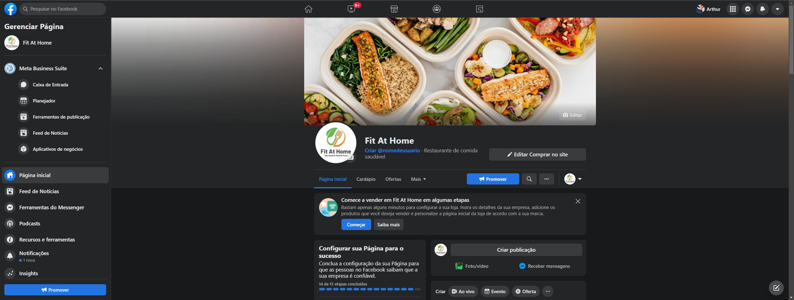
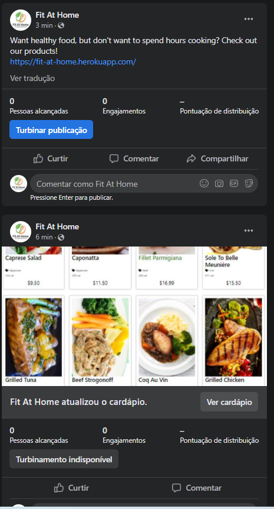
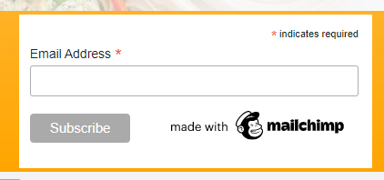

# Fit At Home

https://fit-at-home.herokuapp.com/

## Author

Arthur Henrique El Mezaonik Martins

## Table of Contents

## Project Overview

Fit At Home's main target are those who have a healthy life and don't like to keep having fast food, but also don't have time or skills to cook nice and healthy food.

But not just those guys can consume our product, our product is for everyone that wants to try a new food or simply doesn't know how to cook.

We offer appetizers and main plates, from Vegan food to a plate base on Beef or Pork, and you can have it all on your doorstep without the need to wash the pans after.

## UX

Our main target are those who have a healthy life and but don't have time or skills to cook nice and healthy food. To solve those problems we offer two things.

First is our menu which has a variety of healthy foods, where the costumer can choose between one of our colelctions (appetizer, beef, chicken, pork, fish and vegan) and receive the prepered food at home.

The second is our blog page, where we will have posts teaching how to prepare a nice food, but not just that, also posts talking about healthy life and exercices.

## Target Audience

1. Users that don't have time to prepare their healthy meal

2. Users that have time to cook but don't know how to prepare a nice and healthy meal

3. Users looking for healthy food recipes

4. Users looking for tips about healthy life anf exerceise

## Design Choices

### Colors

The main colors are green and orange, they were chosen to give the impression from something healthier/natural.

The other colors used are mainly black and white, to give a good contrast with the main colors.

### Images

The main image on the home page was chosen to represent that the site wants to bring information about food.

The product images were chosen to represent the food related.

The post images were chosen to represent the post related.

### Design Elements

- desktop navigation
- mobile navigation
- footer
- containers/cards
- buttons
- text input
- textarea inputs
- dropdowns
- toasts
- check boxes
- images
- icons
- file pickers

### Animations and Transitions

- There is a 'loading' animation on checkout page while the payment is being processed

### Frameworks

- Bootstrap 5

- Jquery

## Wireframes

### Initial Mobile

[Mobile Wireframe](https://drive.google.com/file/d/1gLnhB46L9SDnxnSY61gph2sBDCR5KkKZ/view?usp=sharing)

### Initial Desktop

[Desktop Wireframe](https://drive.google.com/file/d/1ct4oan_9gBaWTj5ktf-OG7Q7vjcYJriN/view?usp=sharing)

## ERD

[ERD](https://drive.google.com/file/d/1WYaKM_AtrgNDU4KXwoscfF7YncpBS7dS/view?usp=sharing)

## Agile Process

### Github User Stories

[Created Epic And User Stories](https://github.com/arthurmezaonik/portfolio_project_5/issues)

### Kanban Board

[Kanban Board](https://github.com/arthurmezaonik/portfolio_project_5/projects/2)

## Testing

### Validation Testing

* Lighthouse

    - Before mobile:

    

    

    

    - After mobile:

    

    - Before desktop:

    

    

    

    - After desktop:

    

* HTML Validation

    - Before:

    

    - After:

    

* CSS Validation

    - Before:

    

    - After:

    

* JS Validation

    
    
    - This function is beeing used just on the html file, that's the reason I couldn't fix this erros.

* PEP 8
        
    - No errors found. Files tested website.form.py, website.models.py, website.views.py, website.urls.py, and milestone04.urls.py.

### Manual Testing

[Manual Test Worksheet](https://docs.google.com/spreadsheets/d/1bAlIK_KV-b2nTUmMAlzxKgcm_HXzy-OZRs0tYtHcEks/edit?usp=sharing)

### Bugs

* No bugs reported

### Unifxed Bugs

* No bugs remaining

## E-commerce Business Model

### Facebook Business Page

[Facebook Business Page](https://www.facebook.com/Fit-At-Home-104447422230293)

### Newsletter Sign Up

Used Mailchimp to add a newsletter for on the footer.

## SEO Strategy

### Sitemap

-  created sitemap.xml file to call out files that exist so browsers can easily crawl site

### Robots.txt

- created robots.txt file to restrict pages that are should be searched by google, authentication and others are blocked to only allow relevant pages to be searched by google

## Deployment

This application will be deployed via [Heroku](https://heroku.com)

### Creating App.

1. Ensure all code is correct and ready for deployment.

2. Enter the following code to import the required dependencies to the requirements.txt file:
    > pip3 freeze > requirements.txt

    - Heroku will use this file to import the dependencies that are required.

3. Log into or sign up to Heroku(it's free).

    - If signing up, you will need to wait and accept an authentication email.

4. Navigate to Dashboard. 

5. Click "New" and select "create new app" from the drop-down menu. This is found in the upper right portion of the window.

6. Provide a name for your application, this needs to be unique, and select your region.

7. Click "Create App".

### Setting up database

1. Navigate to "Resources" and click on the field "add-ons".

2. Add Heroku Postgres to the project.

### Setting up Heroku App

1.	Navigate to "Settings" and scroll down to "config vars".

    - That’s where you would store sensitive data that needs to kept secret. On my case my vars SECRET_KEY, DATABASE_URL, CLOUDINARY_URL, EMAIL_HOST_PASS, EMAIL_HOST_USER, STRIPE_PUBLIC_KEY, STRIPE_SECRET_KEY, STRIPE_WH_SECRET.

2. Click "Reveal Config Var", in the field key I entered the vars word and in the value field I copied the content as past there.

### App Deployment

1. Navigate to the "Deploy" section.

2. Scroll down to "Deployment Method" and select "GitHub".

3. Authorize the connection of Heroku to GitHub.

4. Search for your GitHub repository name, and select the correct repository.

5. For Deployment there are two options, Automatic Deployments or Manual.

    - Automatic Deployment: This will prompt Heroku to re-build your app each time you push your code to GitHub.

    - Manual Deployment: This will only prompt Heroku to build your app when you manually tell it to do so.

6. Ensure the correct branch is selected "master/Main", and select the deployment method that you desire. In this case, I will be using Automatic Deployment

## Credits

### Acknowledgments

* Code Institute: 'I think therefore I blog' project, 'Boutique Ado' project

* Malia Havlicek: Reviewing and giving suggestions how to improve my project.

### Media

* Home page image: https://thespoon.tech/territory-foods-lets-restaurants-package-pre-made-meals-for-subscription-delivery/

* Product No Image: https://en.wikipedia.org/wiki/File:Noimage.svg

* Post No Image: https://drivebywebsites.co.uk/2017/06/28/what-are-the-benefits-of-a-blog/

* Caprese Salad: https://www.pinterest.at/Maigris/food-salads-way-beyond-an-iceberg-wedge/

* Caponata: https://www.foodandwine.com/recipes/eggplant-caponata

* Strogonoff: https://rapidolight.com.br/produto/strogonoff-de-carne-light/

* Sole To Belle Meunière: https://en.tripadvisor.com.hk/LocationPhotoDirectLink-g303506-d787028-i467368828-Restaurante_Garota_de_Ipanema-Rio_de_Janeiro_State_of_Rio_de_Janeiro.html

* Grilled Tuna: https://www.libergas.com.br/atum-grelhado/

* Coq Au Vin: https://searchingforspice.com/coq-au-vin/

* Grilled Chicken: https://cybercook.com.br/receitas/aves/file-de-frango-grelhado-85340

* Pork Chops: https://cocinarrecetasdepostres.net/po/costeletas-de-porco-grelhadas-na-frigideira-com-alho-e-verduras/

* Roas Loin: https://www.tvgazeta.com.br/receitas/lombo-assado-com-cebola-caramelizada-e-abacaxi

* Ratatouille: https://www.cookingclassy.com/ratatouille/

* Moroccan Rice: https://br.recepedia.com/receita/arroz/215107-arroz-marroquino/