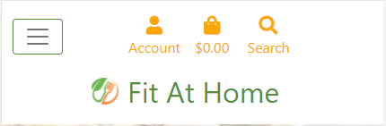
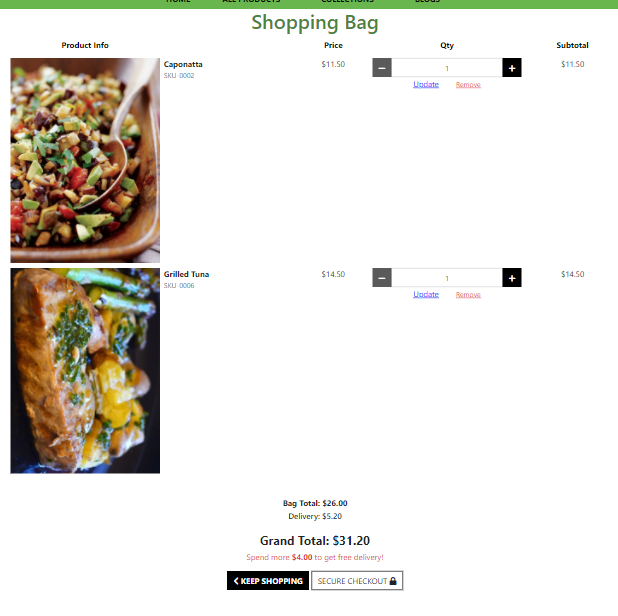

# Fit At Home

https://fit-at-home.herokuapp.com/

## Author

Arthur Henrique El Mezaonik Martins

## Table of Contents

- [Fit At Home](#fit-at-home)
  * [Author](#author)
  * [Table of Contents](#table-of-contents)
  * [Project Overview](#project-overview)
  * [UX](#ux)
  * [Target Audience](#target-audience)
  * [Design Choices](#design-choices)
    + [Colors](#colors)
    + [Images](#images)
    + [Design Elements](#design-elements)
    + [Animations and Transitions](#animations-and-transitions)
    + [Frameworks](#frameworks)
  * [Wireframes](#wireframes)
    + [Initial Mobile](#initial-mobile)
    + [Initial Desktop](#initial-desktop)
  * [ERD](#erd)
  * [Agile Process](#agile-process)
    + [Github User Stories](#github-user-stories)
    + [Kanban Board](#kanban-board)
  * [Features](#features)
    + [Implemented Features](#implemented-features)
      - [Header / Navigation](#header---navigation)
      - [Footer](#footer)
      - [User Area](#user-area)
      - [Products Page](#products-page)
      - [Specific Product Page](#specific-product-page)
      - [Blog Page](#blog-page)
      - [Specific Post Page](#specific-post-page)
      - [Bag](#bag)
      - [Checkout](#checkout)
      - [Confirmation Page](#confirmation-page)
      - [Admin area](#admin-area)
      - [Email Confirmation](#email-confirmation)
    + [Future Features](#future-features)
  * [Testing](#testing)
    + [Validation Testing](#validation-testing)
    + [Manual Testing](#manual-testing)
    + [Bugs](#bugs)
    + [Unifxed Bugs](#unifxed-bugs)
  * [E-commerce Business Model](#e-commerce-business-model)
    + [Facebook Business Page](#facebook-business-page)
    + [Newsletter Sign Up](#newsletter-sign-up)
  * [SEO Strategy](#seo-strategy)
    + [Sitemap](#sitemap)
    + [Robots.txt](#robotstxt)
  * [Deployment](#deployment)
    + [Creating App.](#creating-app)
    + [Setting up database](#setting-up-database)
    + [Setting up Heroku App](#setting-up-heroku-app)
    + [App Deployment](#app-deployment)
  * [Credits](#credits)
    + [Acknowledgments](#acknowledgments)
    + [Media](#media)

<small><i><a href='http://ecotrust-canada.github.io/markdown-toc/'>Table of contents generated with markdown-toc</a></i></small>

## Project Overview

Fit At Home's main target are those who have a healthy life and don't like to keep having fast food, but also don't have time or skills to cook nice and healthy food.

But not just those guys can consume our product, our product is for everyone that wants to try a new food or simply doesn't know how to cook.

We offer appetizers and main plates, from Vegan food to a plate base on Beef or Pork, and you can have it all on your doorstep without the need to wash the pans after.

## UX

Our main target is those who have a healthy life but don't have time or skills to cook nice and healthy food. To solve those problems we offer two things.

First is our menu which has a variety of healthy foods, where the customer can choose between one of our collections (appetizer, beef, chicken, pork, fish, and vegan) and receive the prepared food at home.

The second is our blog page, where we will have posts teaching how to prepare nice food, but not just that, also posts talking about healthy life and exercises.

## Target Audience

1. Users that don't have time to prepare their healthy meal

2. Users that have time to cook but don't know how to prepare a nice and healthy meal

3. Users looking for healthy food recipes

4. Users looking for tips about healthy life and exercise

## Design Choices

### Colors

The main colors are green and orange, they were chosen to give the impression of something healthier/natural.

The other colors used are mainly black and white, to give a good contrast with the main colors.

### Images

The main image on the home page was chosen to represent that the site wants to bring information about food.

The product images were chosen to represent the food-related.

The post images were chosen to represent the post related.

### Design Elements

- desktop navigation
- mobile navigation
- footer
- containers/cards
- buttons
- text input
- textarea inputs
- dropdowns
- toasts
- checkboxes
- images
- icons
- file pickers

### Animations and Transitions

- There is a 'loading' animation on the checkout page while the payment is being processed

### Frameworks

- Bootstrap 5

- Jquery

## Wireframes

### Initial Mobile

[Mobile Wireframe](https://drive.google.com/file/d/1gLnhB46L9SDnxnSY61gph2sBDCR5KkKZ/view?usp=sharing)

### Initial Desktop

[Desktop Wireframe](https://drive.google.com/file/d/1ct4oan_9gBaWTj5ktf-OG7Q7vjcYJriN/view?usp=sharing)

## ERD

[ERD](https://drive.google.com/file/d/1WYaKM_AtrgNDU4KXwoscfF7YncpBS7dS/view?usp=sharing)

## Agile Process

### Github User Stories

[Created Epic And User Stories](https://github.com/arthurmezaonik/portfolio_project_5/issues)

### Kanban Board

[Kanban Board](https://github.com/arthurmezaonik/portfolio_project_5/projects/2)

## Features

### Implemented Features

#### Header / Navigation

* Contains all the main links to navigate on the website.

* Is responsive to attend mobile, tablet, and desktop sizes.

#### Footer

* Contain newsletter form.

* Contain social links as Facebook Businesses

* Is responsive to attend mobile, tablet, and desktop sizes.

#### User Area

* Contain all the user delivery information.

* Allow the user to update the information.

* Display all the user order history

#### Products Page

* Display all the created products with a link to the specific page

* User can sort and filter products

#### Specific Product Page

* Display all the product information

* Display the product reviews

* If logged in allow the user to leave a review

* Link to add to bag

#### Blog Page

* Display all the created posts with status published and give a link to the specific page.

* User can sort posts by name.

#### Specific Post Page

* Display all the post information

* Display the post comments

* If logged in allow the user to leave a comment

#### Bag

* Display all the products that the user added to the bag

* Display total order information

* Allow the user to update quantity or delete items from the bag

* Give the customer a link to the checkout page

#### Checkout

* Display order summary

* Display payment form

* Allow the user to add a card payment to finish the purchase

#### Confirmation Page

* Display an order summary to the user

#### Admin area

* Admin can see all the products and posts created

* Admin can create, update or delete products and posts

#### Email Confirmation

* After a purchase succeed a confirmation email is sent to the customer

### Future Features

* For future features, we hope to implement a way that the users can give a like to products and blog posts.

* We also want to implement a way to send emails to customers that registered in our newsletter when a new blog post is published.

## Testing

### Validation Testing

* Lighthouse

    

    - All test pages result in SEO, Accessibility, and SEO. Best Practices problems are related to missing favicon and Bootstrap toasts.

* HTML Validation

    

    - All tested pages returned 0 problems, just some warnings.

* CSS Validation

    - All custom CSS files were tested and returned 0 problems.

* JS Validation

    
    
    - Custom JS codes tested and passed. Errors are related to jQuery syntax.

* PEP 8
        
    - All python files were checked via terminal with command python3 -m flake8. The only issues remaining are related to migration files.

### Manual Testing

[Manual Test Worksheet](https://docs.google.com/spreadsheets/d/1HONufJy1f4soVv9XgvTSbkdYAIRkhs5QyIVhN0T5h3E/edit?usp=sharing)

### Bugs

* Checkout form not adding customer data automatically with saved information.

### Unifxed Bugs

* Checkout form not adding customer data automatically with saved information.

## E-commerce Business Model

### Facebook Business Page

[Facebook Business Page](https://www.facebook.com/Fit-At-Home-104447422230293)

### Newsletter Sign Up

I used Mailchimp to add a newsletter on the footer.

## SEO Strategy

### Sitemap

-  created sitemap.xml file to call out files that exist so browsers can easily crawl the site

### Robots.txt

- created robots.txt file to restrict pages that are should be searched by google, authentication and others are blocked to only allow relevant pages to be searched by google

## Deployment

This application will be deployed via [Heroku](https://heroku.com)

### Creating App.

1. Ensure all code is correct and ready for deployment.

2. Enter the following code to import the required dependencies to the requirements.txt file:
    > pip3 freeze > requirements.txt

    - Heroku will use this file to import the dependencies that are required.

3. Log into or sign up to Heroku(it's free).

    - If signing up, you will need to wait and accept an authentication email.

4. Navigate to Dashboard. 

5. Click "New" and select "create new app" from the drop-down menu. This is found in the upper right portion of the window.

6. Provide a name for your application, this needs to be unique, and select your region.

7. Click "Create App".

### Setting up database

1. Navigate to "Resources" and click on the field "add-ons".

2. Add Heroku Postgres to the project.

### Setting up Heroku App

1.	Navigate to "Settings" and scroll down to "config vars".

    - That’s where you would store sensitive data that needs to be kept secret. On my case my vars SECRET_KEY, DATABASE_URL, CLOUDINARY_URL, EMAIL_HOST_PASS, EMAIL_HOST_USER, STRIPE_PUBLIC_KEY, STRIPE_SECRET_KEY, STRIPE_WH_SECRET.

2. Click "Reveal Config Var", in the field key I entered the vars word, and in the value field, I copied the content as past there.

### App Deployment

1. Navigate to the "Deploy" section.

2. Scroll down to "Deployment Method" and select "GitHub".

3. Authorize the connection of Heroku to GitHub.

4. Search for your GitHub repository name, and select the correct repository.

5. For Deployment there are two options, Automatic Deployments or Manual.

    - Automatic Deployment: This will prompt Heroku to re-build your app each time you push your code to GitHub.

    - Manual Deployment: This will only prompt Heroku to build your app when you manually tell it to do so.

6. Ensure the correct branch is selected "master/Main", and select the deployment method that you desire. In this case, I will be using Automatic Deployment

## Credits

### Acknowledgments

* Code Institute: 'I think therefore I blog' project, 'Boutique Ado' project

* Malia Havlicek: Reviewing and giving suggestions on how to improve my project.

### Media

* Home page image: https://thespoon.tech/territory-foods-lets-restaurants-package-pre-made-meals-for-subscription-delivery/

* Product No Image: https://en.wikipedia.org/wiki/File:Noimage.svg

* Post No Image: https://drivebywebsites.co.uk/2017/06/28/what-are-the-benefits-of-a-blog/

* Caprese Salad: https://www.pinterest.at/Maigris/food-salads-way-beyond-an-iceberg-wedge/

* Caponata: https://www.foodandwine.com/recipes/eggplant-caponata

* Strogonoff: https://rapidolight.com.br/produto/strogonoff-de-carne-light/

* Sole To Belle Meunière: https://en.tripadvisor.com.hk/LocationPhotoDirectLink-g303506-d787028-i467368828-Restaurante_Garota_de_Ipanema-Rio_de_Janeiro_State_of_Rio_de_Janeiro.html

* Grilled Tuna: https://www.libergas.com.br/atum-grelhado/

* Coq Au Vin: https://searchingforspice.com/coq-au-vin/

* Grilled Chicken: https://cybercook.com.br/receitas/aves/file-de-frango-grelhado-85340

* Pork Chops: https://cocinarrecetasdepostres.net/po/costeletas-de-porco-grelhadas-na-frigideira-com-alho-e-verduras/

* Roast Loin: https://www.tvgazeta.com.br/receitas/lombo-assado-com-cebola-caramelizada-e-abacaxi

* Ratatouille: https://www.cookingclassy.com/ratatouille/

* Moroccan Rice: https://br.recepedia.com/receita/arroz/215107-arroz-marroquino/